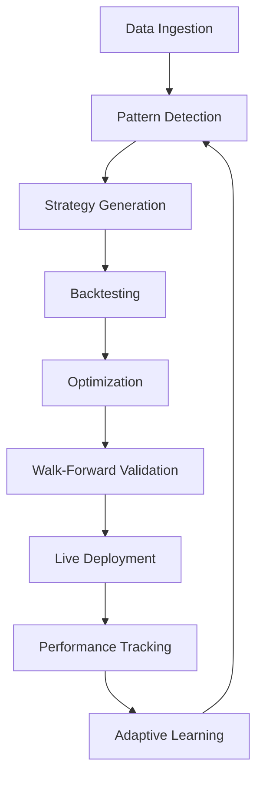

# ncOS Strategy Research Bundle (SRB) v2.0
## With Integrated Backtesting & Pattern Recognition Framework

### Executive Summary
This enhanced SRB combines the original multi-timeframe research capabilities with sophisticated backtesting and ML-powered pattern recognition, creating a complete strategy development and validation ecosystem.

### Core Architecture

```yaml
SRB_v2_Architecture:
  Core_Components:
    Research_Module:
      - Multi-timeframe data ingestion
      - Wyckoff phase detection
      - SMC order block analysis
      - Liquidity sweep detection
      - Pattern confluence scoring

    Backtesting_Engine:
      - VectorBT integration for high-speed backtesting
      - Backtrader for complex multi-agent strategies
      - Walk-forward optimization
      - Monte Carlo simulation
      - Risk-adjusted metrics

    Pattern_Recognition:
      - ML-enhanced pattern validation
      - Harmonic pattern detection
      - Real-time pattern streaming
      - Multi-timeframe confluence
      - Adaptive learning system

    Memory_System:
      - Pattern performance database
      - Strategy version control
      - Trade journal integration
      - Performance attribution
      - Adaptive optimization

### Implementation Structure

```python
class EnhancedSRBSystem:
    '''
    Strategy Research Bundle with integrated backtesting
    '''

    def __init__(self, config: Dict[str, Any]):
        # Core SRB components
        self.data_pipeline = DataIngestionPipeline(config)
        self.pattern_engine = AdvancedPatternRecognizer(config)
        self.wyckoff_analyzer = WyckoffPhaseDetector(config)
        self.smc_analyzer = SMCAnalyzer(config)

        # Backtesting integration
        self.vectorbt_engine = VectorBTIntegration(config)
        self.backtrader_engine = BacktraderMultiAgent(config)

        # Research memory
        self.strategy_db = StrategyDatabase(config)
        self.performance_tracker = PerformanceTracker(config)

    async def research_workflow(self, symbol: str, timeframes: List[str]):
        '''Complete research workflow with backtesting'''

        # 1. Data Collection
        data = await self.data_pipeline.collect_multi_timeframe(symbol, timeframes)

        # 2. Pattern Analysis
        patterns = await self.analyze_patterns(data)

        # 3. Strategy Generation
        strategies = await self.generate_strategies(patterns)

        # 4. Backtesting
        backtest_results = await self.backtest_strategies(strategies, data)

        # 5. Optimization
        optimized = await self.optimize_parameters(strategies, backtest_results)

        # 6. Validation
        validation = await self.walk_forward_analysis(optimized, data)

        # 7. Report Generation
        report = await self.generate_research_report(validation)

        return report
```

### Key Features Integration

#### 1. **Pattern Recognition + Backtesting**
```python
class PatternBacktestIntegration:
    def backtest_pattern_performance(self, pattern_type: str, historical_data: pd.DataFrame):
        # Identify all historical occurrences of pattern
        pattern_signals = self.pattern_engine.detect_pattern(pattern_type, historical_data)

        # Create entry/exit signals
        entries = pattern_signals['entry_points']
        exits = pattern_signals['exit_points']

        # Run VectorBT backtest
        portfolio = vbt.Portfolio.from_signals(
            close=historical_data['close'],
            entries=entries,
            exits=exits,
            init_cash=10000,
            fees=0.001
        )

        # Store pattern performance
        self.strategy_db.store_pattern_metrics({
            'pattern_type': pattern_type,
            'win_rate': portfolio.win_rate(),
            'profit_factor': portfolio.profit_factor(),
            'sharpe_ratio': portfolio.sharpe_ratio(),
            'max_drawdown': portfolio.max_drawdown()
        })
```

#### 2. **Wyckoff + SMC Backtesting**
```python
class WyckoffSMCBacktest(bt.Strategy):
    '''Backtrader strategy combining Wyckoff and SMC'''

    def __init__(self):
        self.wyckoff_phase = None
        self.smc_signal = None
        self.order_blocks = []

    def next(self):
        # Get current analysis
        current_data = self.get_current_window()

        # Wyckoff phase detection
        self.wyckoff_phase = self.detect_wyckoff_phase(current_data)

        # SMC analysis
        self.smc_signal = self.analyze_smc_structure(current_data)

        # Combined signal
        if self.should_enter():
            self.execute_trade()
```

#### 3. **Real-time Pattern Validation**
```python
class RealtimePatternValidator:
    def __init__(self):
        self.pattern_performance = {}
        self.confidence_thresholds = {}

    async def validate_pattern_signal(self, pattern: Dict) -> Dict:
        # Get historical performance
        hist_performance = self.strategy_db.get_pattern_stats(
            pattern['type'], 
            pattern['timeframe']
        )

        # Calculate dynamic confidence
        confidence = self.calculate_pattern_confidence(
            pattern, 
            hist_performance,
            current_market_conditions
        )

        # Risk adjustment
        position_size = self.calculate_position_size(
            confidence,
            hist_performance['max_drawdown']
        )

        return {
            'pattern': pattern,
            'confidence': confidence,
            'historical_win_rate': hist_performance['win_rate'],
            'suggested_position_size': position_size,
            'risk_reward_ratio': hist_performance['avg_rr_ratio']
        }
```

### Workflow Integration



### Performance Metrics Dashboard

```python
class SRBPerformanceDashboard:
    def generate_comprehensive_report(self, strategy_id: str) -> Dict:
        return {
            'pattern_analysis': {
                'wyckoff_phases': self.get_wyckoff_performance(),
                'smc_patterns': self.get_smc_performance(),
                'harmonic_patterns': self.get_harmonic_performance()
            },
            'backtest_results': {
                'vectorbt_metrics': self.get_vectorbt_results(),
                'backtrader_metrics': self.get_backtrader_results(),
                'walk_forward': self.get_walk_forward_results()
            },
            'risk_metrics': {
                'max_drawdown': self.calculate_max_dd(),
                'var_95': self.calculate_var(),
                'sharpe_ratio': self.calculate_sharpe(),
                'sortino_ratio': self.calculate_sortino()
            },
            'optimization_results': {
                'best_parameters': self.get_optimized_params(),
                'parameter_sensitivity': self.get_sensitivity_analysis(),
                'out_of_sample_performance': self.get_oos_performance()
            }
        }
```

### Data Pipeline Enhancement

```python
class EnhancedDataPipeline:
    def __init__(self, config: Dict):
        self.data_sources = config['data_sources']
        self.storage = TimeSeriesDatabase(config)

    async def prepare_backtest_data(self, symbol: str, start: datetime, end: datetime):
        # Multi-source data collection
        data = await self.collect_from_sources(symbol, start, end)

        # Data quality checks
        data = self.validate_and_clean(data)

        # Feature engineering
        data = self.engineer_features(data)

        # Multi-timeframe alignment
        mtf_data = self.create_mtf_dataset(data)

        return mtf_data
```

### Integration Benefits

1. **Research-to-Production Pipeline**
   - Seamless flow from pattern discovery to validated strategy
   - Automated parameter optimization
   - Continuous learning from live performance

2. **Risk Management Integration**
   - Pattern-specific risk limits
   - Dynamic position sizing based on backtest metrics
   - Drawdown control from historical analysis

3. **Performance Attribution**
   - Which patterns contribute most to returns
   - Timeframe analysis
   - Market regime performance

4. **Adaptive Strategy Evolution**
   - Patterns that stop working are automatically deprecated
   - New patterns are validated before deployment
   - Continuous optimization based on recent performance

### Quick Start Implementation

```python
# Initialize enhanced SRB
srb = EnhancedSRBSystem(config={
    'data_sources': ['yfinance', 'alpaca', 'polygon'],
    'backtesting_engines': ['vectorbt', 'backtrader'],
    'pattern_types': ['wyckoff', 'smc', 'harmonic', 'classic'],
    'optimization_method': 'genetic_algorithm',
    'walk_forward_windows': 12,
    'risk_limit': 0.02  # 2% per trade
})

# Run complete research workflow
async def main():
    # Research multiple symbols
    symbols = ['EURUSD', 'GBPUSD', 'GOLD']
    timeframes = ['5m', '15m', '1h', '4h', '1d']

    for symbol in symbols:
        report = await srb.research_workflow(symbol, timeframes)

        # Deploy profitable strategies
        if report['sharpe_ratio'] > 1.5 and report['win_rate'] > 0.6:
            await srb.deploy_strategy(report['strategy_id'])

# Execute
asyncio.run(main())
```

### Next Steps

1. **Implement Core Integration**
   - Set up VectorBT and Backtrader engines
   - Create pattern-to-signal converters
   - Build performance database

2. **Develop Testing Framework**
   - Unit tests for each component
   - Integration tests for workflow
   - Performance benchmarks

3. **Create Monitoring Dashboard**
   - Real-time pattern performance
   - Strategy health metrics
   - Risk exposure monitoring

4. **Documentation**
   - API documentation
   - Strategy development guide
   - Deployment procedures
